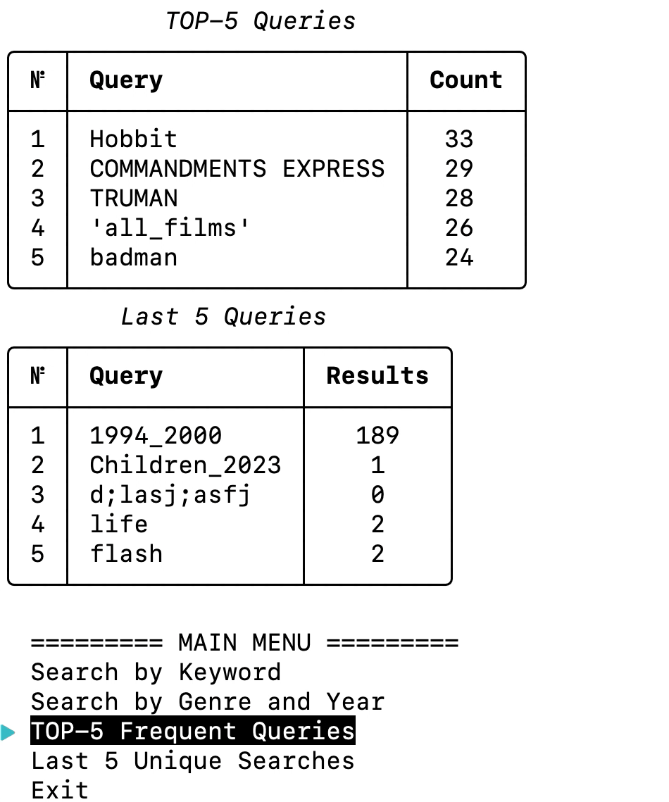
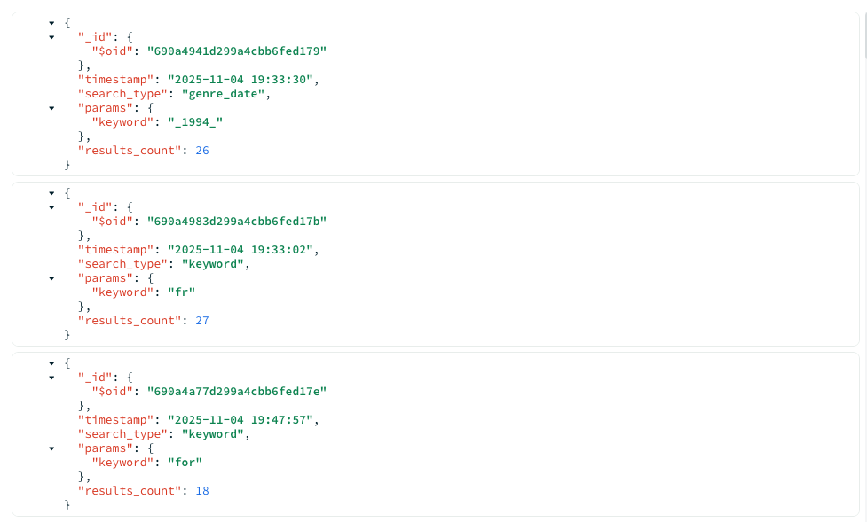

# Cinema Search & Analytics Engine CLI(Command Line Interface)

A professional Backend application developed in Python to demonstrate a robust data pipeline between **Relational (MySQL)** and **Non-Relational (MongoDB)** databases.

## Project Overview
This Command Line Interface (CLI) tool bridges the gap between structured movie data and real-time user behavior tracking.

- **Primary Storage:** MySQL (Sakila database) for reliable film data retrieval.
- **Analytics Storage:** MongoDB for high-speed logging of search events and history.
- **Interface:** Interactive and modern terminal UI built with `Rich` and `simple-term-menu`.

## Key Features
- **Smart Search:** Filter movies by keyword, genre, or specific release years.
- **Automated Logging:** Every search query is asynchronously logged into MongoDB.
- **Data Insights:** Analytics module that displays the "Top 5 Frequent Queries".

## Terminal User Interface
The application features a clean, professional CLI built with the `Rich` library, providing formatted tables and interactive menus.


*Example of the movie search results table and interactive main menu.*
  
## Database Visualization (MongoDB Logs)

*Example of a search log document in MongoDB Compass, highlighting the storage of search parameters, result counts, and timestamps.*

## Installation & Setup
1. **Clone the repository:**
   ```bash
   git clone https://github.com/yanchuk-lab/CineSearch-Analytics-Terminal-App.git
2. Install dependencies:
   pip install -r requirements.txt
3. Configure Access:
   - Locate config_template.py in the root directory.
   - Rename it to config.py.
   - Fill in your MySQL and MongoDB credentials.
5. Run the Application:
   python main.py

*Developed as a portfolio project to demonstrate Backend Architecture and Database Integration skills.*
